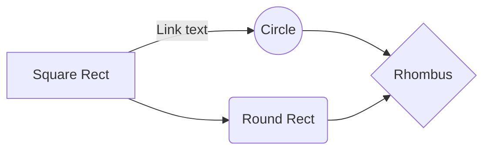

## Supervised Machine Learning: Regression and Classification

 > Week 1 - Learning Objectives

* Define machine learning
* Define supervised learning
* Define unsupervised learning
* Write and run Python code in Jupyter Notebooks
* Define a regression model
* Implement and visualize a cost function
* Implement gradient descent
* Optimize a regression model using gradient descent

First Header  | Second Header
------------- | -------------
Content Cell  | Content Cell
Content Cell  | Content Cell 

- [x] #739
- [ ] https://github.com/octo-org/octo-repo/issues/740
- [ ] Add delight to the experience when all tasks are complete :tada:
- [ ] \(Optional) Open a followup issue

` aaa -   d`

