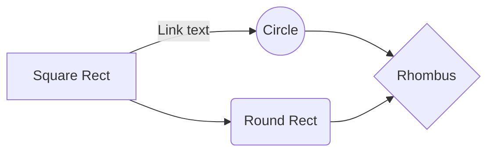

## 1./3 - `Supervised Machine Learning: Regression and Classification   `  

 

  > ### Week 1 - `Introduction to Machine Learning  ` :tada:  

- [x] Define machine learning
- [x] Define supervised learning
- [x] Define unsupervised learning
- [x] Write and run Python code in Jupyter Notebooks
- [x] Define a regression model
- [x] Implement and visualize a cost function
- [x] Implement gradient descent
- [x] Optimize a regression model using gradient descent
 

 > ### Week 2 - `Regression with multiple input variables ` :tada:

- [x] Use vectorization to implement multiple linear regression
- [x] Use feature scaling, feature engineering, and polynomial regression to improve model training
- [x] Implement linear regression in code

 

 > ### Week 3 - ` Classification` :tada:

- [x] Use logistic regression for binary classification
- [x] Implement logistic regression for binary classification
- [x] Address overfitting using regularization, to improve model performance

.
-------------------------------------------------------------------------------------------

 

## 2./3 - `Advanced Learning Algorithms   `  

 

 > ### Week 2 - `Neural Networks ` :tada:

- [x] Get familiar with the diagram and components of a neural network
- [x] Understand the concept of a "layer" in a neural network
- [x] Understand how neural networks learn new features.
- [x] Understand how activations are calculated at each layer.
- [x] Learn how a neural network can perform classification on an image.
- [x] Use a framework, TensorFlow, to build a neural network for classification of an image.
- [x] Learn how data goes into and out of a neural network layer in TensorFlow
- [x] Build a neural network in regular Python code (from scratch) to make predictions.
- [x] (Optional): Learn how neural networks use parallel processing (vectorization) to make computations faster.

 

First Header  | Second Header
------------- | -------------
Content Cell  | Content Cell
Content Cell  | Content Cell 

- [ ] \(Optional) Open a followup issue

