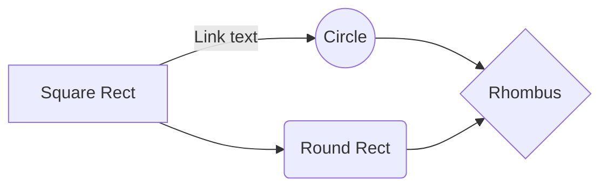

## 1 - `Supervised Machine Learning: Regression and Classification   `  

 

  > ### Week 1 - `Introduction to Machine Learning  `  

- [x] Define machine learning
- [x] Define supervised learning
- [x] Define unsupervised learning
- [x] Write and run Python code in Jupyter Notebooks
- [x] Define a regression model
- [x] Implement and visualize a cost function
- [x] Implement gradient descent
- [x] Optimize a regression model using gradient descent
 

 > ### Week 2 - `Regression with multiple input variables `

- [x] Use vectorization to implement multiple linear regression
- [x] Use feature scaling, feature engineering, and polynomial regression to improve model training
- [x] Implement linear regression in code

.

First Header  | Second Header
------------- | -------------
Content Cell  | Content Cell
Content Cell  | Content Cell 

- [x] #739
- [ ] https://github.com/octo-org/octo-repo/issues/740
- [ ] Add delight to the experience when all tasks are complete :tada:
- [ ] \(Optional) Open a followup issue

` aaa -   d`

