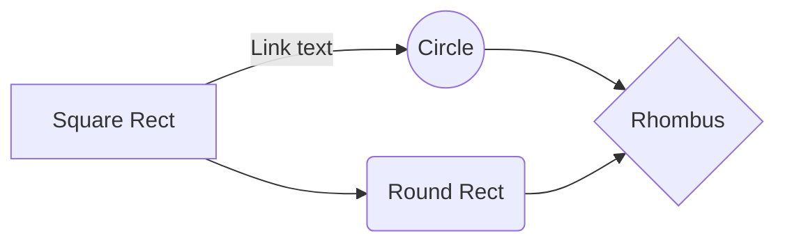

## 1./3 - `Supervised Machine Learning: Regression and Classification   `  

 

  > ### Week 1 - `Introduction to Machine Learning  ` :tada:  

- [x] Define machine learning
- [x] Define supervised learning
- [x] Define unsupervised learning
- [x] Write and run Python code in Jupyter Notebooks
- [x] Define a regression model
- [x] Implement and visualize a cost function
- [x] Implement gradient descent
- [x] Optimize a regression model using gradient descent
 

 > ### Week 2 - `Regression with multiple input variables ` :tada:

- [x] Use vectorization to implement multiple linear regression
- [x] Use feature scaling, feature engineering, and polynomial regression to improve model training
- [x] Implement linear regression in code

 

 > ### Week 3 - ` Classification` :tada:

- [x] Use logistic regression for binary classification
- [x] Implement logistic regression for binary classification
- [x] Address overfitting using regularization, to improve model performance

.
-------------------------------------------------------------------------------------------

 

## 2./3 - `Advanced Learning Algorithms   `  

 

 > ### Week 1 - `Neural Networks ` :tada:

- [x] Get familiar with the diagram and components of a neural network
- [x] Understand the concept of a "layer" in a neural network
- [x] Understand how neural networks learn new features.
- [x] Understand how activations are calculated at each layer.
- [x] Learn how a neural network can perform classification on an image.
- [x] Use a framework, TensorFlow, to build a neural network for classification of an image.
- [x] Learn how data goes into and out of a neural network layer in TensorFlow
- [x] Build a neural network in regular Python code (from scratch) to make predictions.
- [x] (Optional): Learn how neural networks use parallel processing (vectorization) to make computations faster.

 

 > ### Week 2 - `Neural Network Trainig ` :tada:

- [x] Train a neural network on data using TensorFlow
- [x] Understand the difference between various activation functions (sigmoid, ReLU, and linear)
- [x] Understand which activation functions to use for which type of layer
- [x] Understand why we need non-linear activation functions
- [x] Understand multiclass classification
- [x] Calculate the softmax activation for implementing multiclass classification
- [x] Use the categorical cross entropy loss function for multiclass classification
- [x] Use the recommended method for implementing multiclass classification in code
- [x] (Optional): Explain the difference between multi-label and multiclass classification

 

 > ### Week 3 - `Advice for applying machine learning` :tada:

- [x] Evaluate and then modify your learning algorithm or data to improve your model's performance
- [x] Evaluate your learning algorithm using cross validation and test datasets.
- [x] Diagnose bias and variance in your learning algorithm
- [x] Use regularization to adjust bias and variance in your learning algorithm
- [x] Identify a baseline level of performance for your learning algorithm
- [x] Understand how bias and variance apply to neural networks
- [x] Learn about the iterative loop of Machine Learning Development that's used to update and improve a machine learning model
- [x] Learn to use error analysis to identify the types of errors that a learning algorithm is making
- [x] Learn how to add more training data to improve your model, including data augmentation and data synthesis
- [x] Use transfer learning to improve your model's performance.
- [x] Learn to include fairness and ethics in your machine learning model development
- [x] Measure precision and recall to work with skewed (imbalanced) datasets

 

 > ### Week 4 - `Decision trees` :tada:

- [x] See what a decision tree looks like and how it can be used to make predictions
- [x] Learn how a decision tree learns from training data
- [x] Learn the "impurity" metric "entropy" and how it's used when building a decision tree
- [x] Learn how to use multiple trees, "tree ensembles" such as random forests and boosted trees
- [x] Learn when to use decision trees or neural networks

 

## 3./3 - `Unsupervised Learning, Recommenders, Reinforcement Learning  `  

 

  > ### Week 1 - `Unsupervised Learning  ` :tada:  

- [x] Implement the k-means clustering algorithm
- [x] Implement the k-means optimization objective
- [x] Initialize the k-means algorithm
- [x] Choose the number of clusters for the k-means algorithm
- [x] Implement an anomaly detection system
- [x] Decide when to use supervised learning vs. anomaly detection
- [x] Implement the centroid update function in k-means
- [x] Implement the function that finds the closest centroids to each point in k-means

 

First Header  | Second Header
------------- | -------------
Content Cell  | Content Cell
Content Cell  | Content Cell 

- [ ] \(Optional) Open a followup issue

